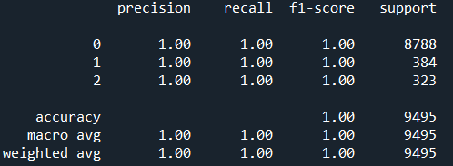

# Prediction of the Outcome of Marketing Campaign on Bank Customers

This Deep Learning project is an assignment project to predict the outcome of marketing campaign conducted 
by banks on its customers. It will help banks to identify the best customer segments to
persuade more clients to deposit money into the bank, thus increasing the bank's revenue.

## Table of Contents

* [Technologies](#technologies)
* [Installation](#installation)
* [Model](#model)
* [Credits and Acknowledgments](#credits-and-acknowledgements)

## Technologies

- Spyder (Python 3.8)
- Google Colab (Python 3.6)
    - OS
    - Scipy
    - Pickle
    - Pandas
    - Numpy
    - Seaborn
    - Missingno
    - Matplotlib
    - Tensorflow
    - Scikit Learn
    
## Installation

1) Go to [Google Colab](https://colab.research.google.com/) and sign in with your Google account
2) Download the models folder from the repository and upload it in Google Colab
3) Run the model

## Model

## Credits and Acknowledgements

This data was sourced from [Customer Segmentation | Kaggle](https://www.kaggle.com/datasets/kunalgupta2616/hackerearth-customer-segmentation-hackathon)

Special thanks to Alex Koh and Warren Loo from SHRDC for the guidance and training to make 
this project possible.
